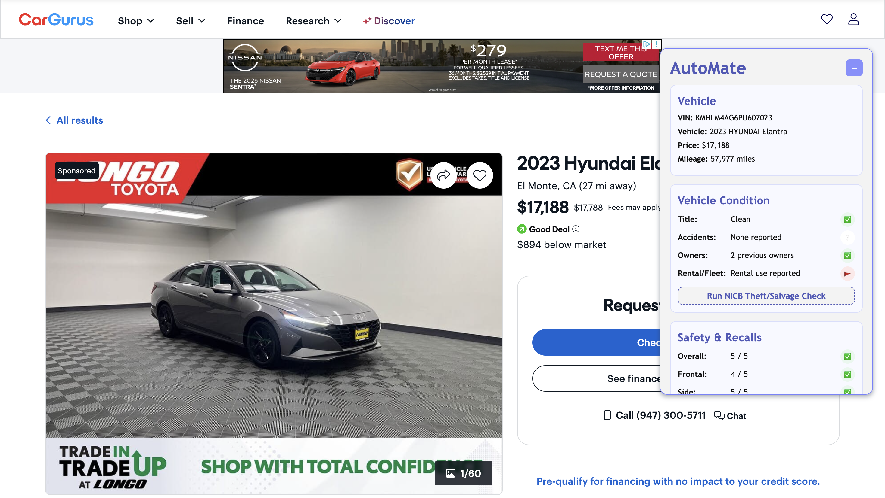
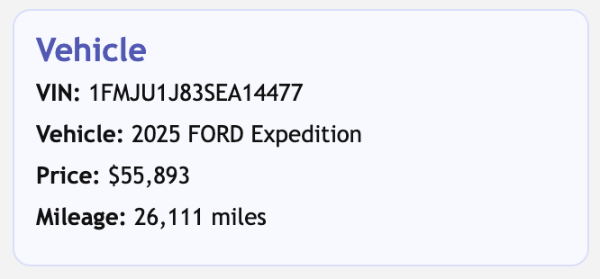
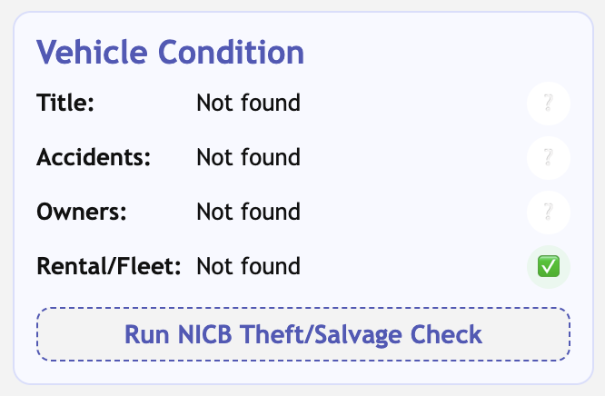
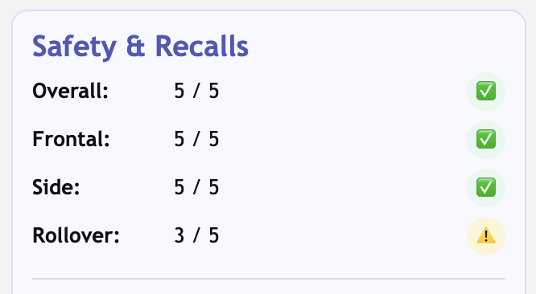
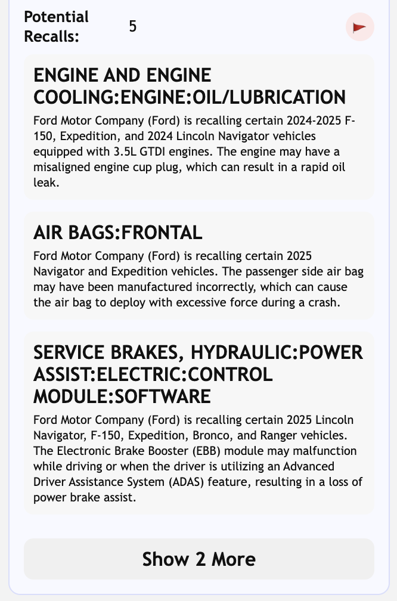
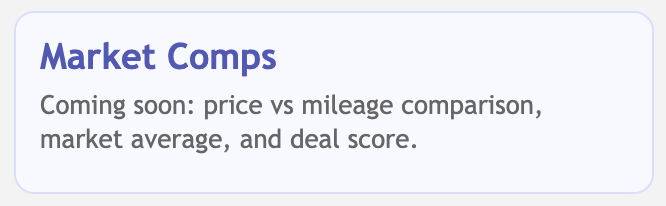

# AutoMate

AutoMate is a Chrome extension that makes the car shopping experience by using:
- VIN decoding
- Vehicle condition indicators
- NHTSA safety ratings & recall data
- Rental/fleet detection
- Dynamic dealership sidebar UI

## Supported Websites
- CarGurus
- Cars.com
- Dealership sites

## Future Features
- Market comps
- Reliability scoring

## Screenshots

